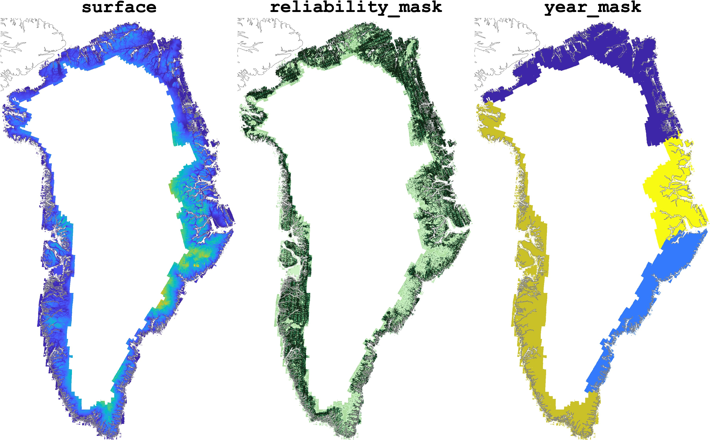

# AERODEM
A simple script to create a mosaic of Korsgaard's tiled G150 AERODEM Greenland Ice Sheet surface elevation data and save it as a NetCDF. 

### Important points: 
* The final mosaic is on the same 150 m grid as BedMachine v5. 
* To match BedMachine, I've referenced the final surface elevations to the eigen-6c4 geoid.

### Accessing the data: 
* Raw, tiled data [here](https://www.nodc.noaa.gov/archive/arc0088/0145405/1.1/data/0-data/G150AERODEM/). 
* Converted mosaic [here](https://www.chadagreene.com/data/AERODEM_Korsgaard_mosaic.nc).

# Repository Contents

This repo contains: 

* **`korsgaard2grid.m`** MATLAB script for converting Korsgaard's AERODEM Greenland DEM tiles into a mosaic. 
* **`load_and_plot_AERODEM.m`** A simple script to load the data created by `korsgaard2grid.m`, then create this plot:

# Citation 
If you use this data, please cite the original source of the data: 

Korsgaard, N., Nuth, C., Khan, S. et al. Digital elevation model and orthophotographs of Greenland based on aerial photographs from 1978–1987. *Sci Data* 3, 160032 (2016). [https://doi.org/10.1038/sdata.2016.32](https://doi.org/10.1038/sdata.2016.32)